# Architecture Documentation

## Table of Contents

1. [System Overview](#system-overview)
2. [High-Level Architecture](#high-level-architecture)
3. [Component Architecture](#component-architecture)
4. [Data Flow](#data-flow)
5. [Technology Stack](#technology-stack)
6. [Directory Structure](#directory-structure)
7. [API Contracts](#api-contracts)
8. [Database Schema](#database-schema)
9. [Key Design Decisions](#key-design-decisions)
10. [Deployment Architecture](#deployment-architecture)

---

## System Overview

**Agent View** is a Next.js application that provides a web-based user interface for managing multiple Claude Code agents using the [Claude Agent SDK](https://docs.claude.com/en/api/agent-sdk/overview). It enables developers to spawn, monitor, and control AI agents working across different projects and directories from any device on their network.

### Core Capabilities

- **Multi-Agent Orchestration**: Spawn and manage up to 20 concurrent agents with independent contexts
- **Directory-Based Isolation**: Each agent operates in its assigned workspace with configurable tool permissions
- **Real-Time Monitoring**: Stream agent progress, tool usage, and outputs via Server-Sent Events (SSE)
- **Session Management**: Reply to agents, fork conversations, and pause/resume with full context preservation
- **Remote Access**: Mobile-friendly UI for monitoring agents from smartphones and tablets
- **Project Discovery**: Automatic project and git worktree detection for organizational context
- **Permission Management**: Fine-grained control over which SDK tools each agent can access
- **OpenSpec Integration**: Spec-driven development workflow support

### Architecture Style

Agent View follows a **layered client-server architecture** with:
- **Frontend**: React-based SPA using Next.js App Router
- **Backend**: Next.js API routes with in-memory state management
- **Persistence**: Optional SQLite database for session history and configuration
- **External Integration**: Claude Agent SDK for AI agent orchestration

---

## High-Level Architecture

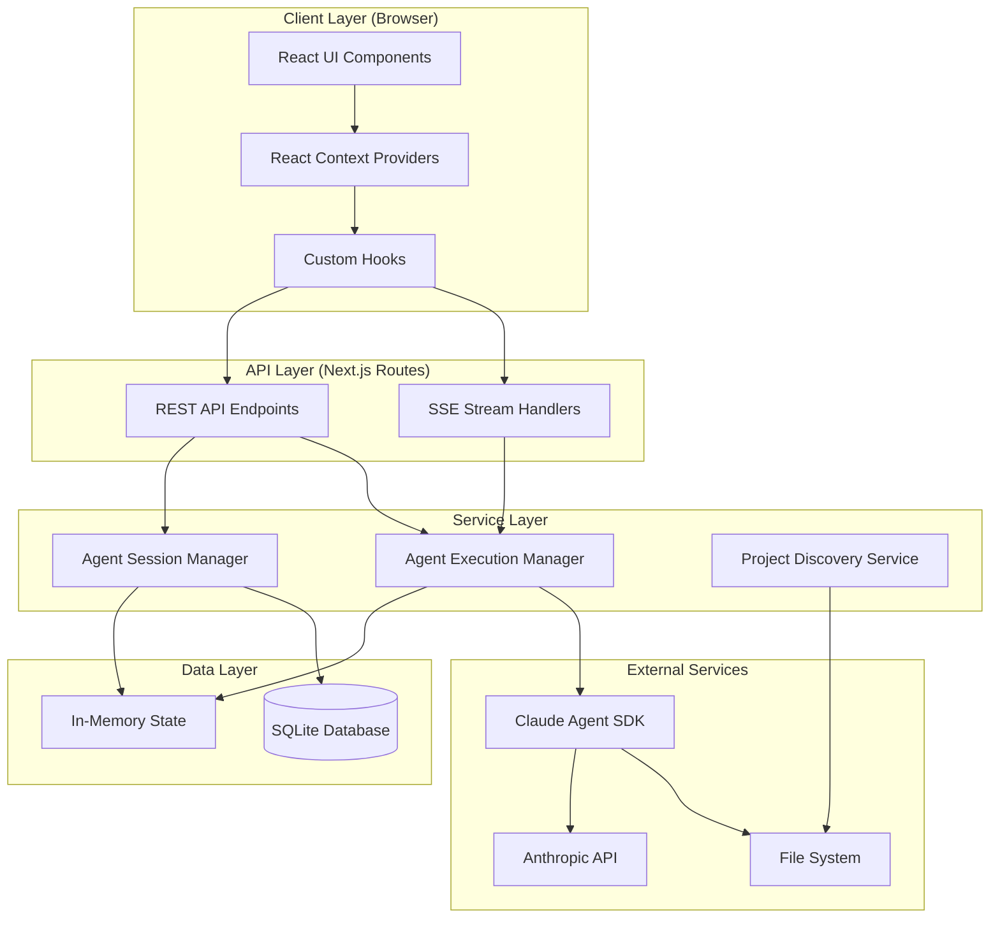

### Key Architectural Patterns

1. **Singleton Pattern**: Session and Execution managers use singletons with hot-reload preservation
2. **Publisher-Subscriber**: Message broadcasting for real-time agent output streaming
3. **Repository Pattern**: Database access abstraction with graceful degradation
4. **Context Provider Pattern**: React Context for state management across components
5. **Async Generator Pattern**: Claude SDK query execution with streaming results

---

## Component Architecture

### Frontend Components

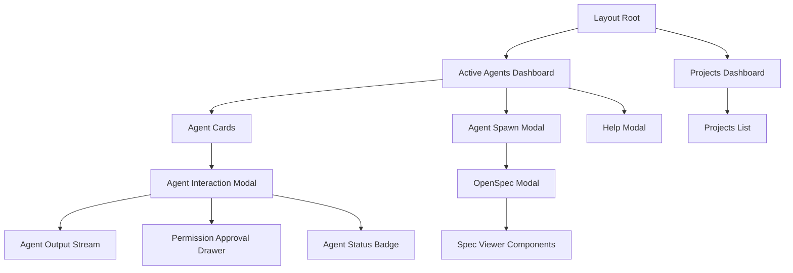

#### Component Hierarchy

**Core Features** (`src/components/features/`)
- `active-agents-dashboard.tsx` - Main dashboard with agent grid
- `agent-card.tsx` - Individual agent card with quick actions
- `agent-interaction-modal.tsx` - Full agent details and control panel
- `agent-spawn-modal.tsx` - Form for creating new agents
- `agent-output-stream.tsx` - Real-time SSE stream display
- `permission-approval-drawer.tsx` - Tool permission approval UI
- `agent-status-badge.tsx` - Visual status indicators
- `help-modal.tsx` - Keyboard shortcuts and help
- `projects-dashboard.tsx` - Project and worktree management

**OpenSpec Components** (`src/components/openspec/`)
- `openspec-modal.tsx` - OpenSpec viewer with navigation
- `capability-card.tsx`, `change-card.tsx`, `archive-card.tsx` - Spec entity displays
- `validation-panel.tsx` - Spec validation results
- `markdown-renderer.tsx`, `markdown-editor.tsx` - Markdown handling
- `slash-command-button.tsx` - OpenSpec CLI integration

**UI Primitives** (`src/components/ui/`)
- `button.tsx`, `card.tsx`, `input.tsx`, `textarea.tsx`, `badge.tsx`, `tabs.tsx`

### Backend Services

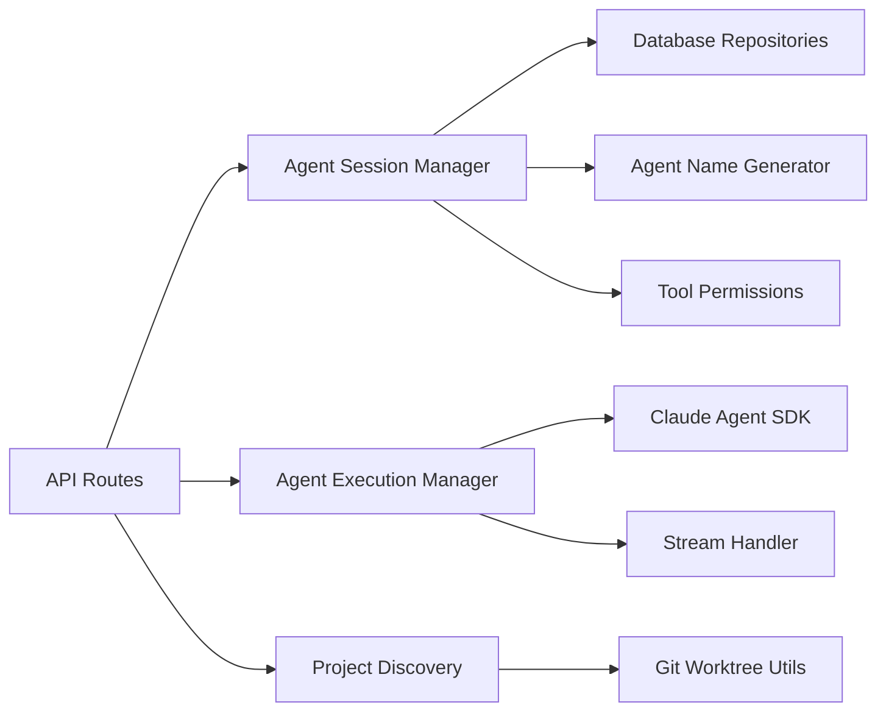

#### Service Layer Components

**Agent Session Manager** (`src/lib/agent-session-manager.ts`)
- In-memory session state management
- Agent lifecycle operations (create, pause, resume, stop, rename)
- Session history tracking (last 10 agents)
- Tool permission approval queuing
- Database persistence coordination

**Agent Execution Manager** (`src/lib/agent-execution-manager.ts`)
- Background agent execution orchestration
- Publisher-subscriber message broadcasting
- Message buffering for late subscribers (1000 messages/agent)
- Concurrent agent limit enforcement (20 max)
- Approval callback coordination
- Resource cleanup on completion

**Project Discovery Service** (`src/lib/services/project-discovery.ts`)
- Automatic project detection from directory paths
- Git repository and worktree detection
- Project metadata persistence
- Worktree association tracking

**Database Layer** (`src/lib/database/`)
- `client.ts` - SQLite connection with hot-reload safety
- `schema.ts` - Table definitions and migrations
- `repositories/` - Data access objects for agents, messages, projects, configs

---

## Data Flow

### Agent Spawning Flow

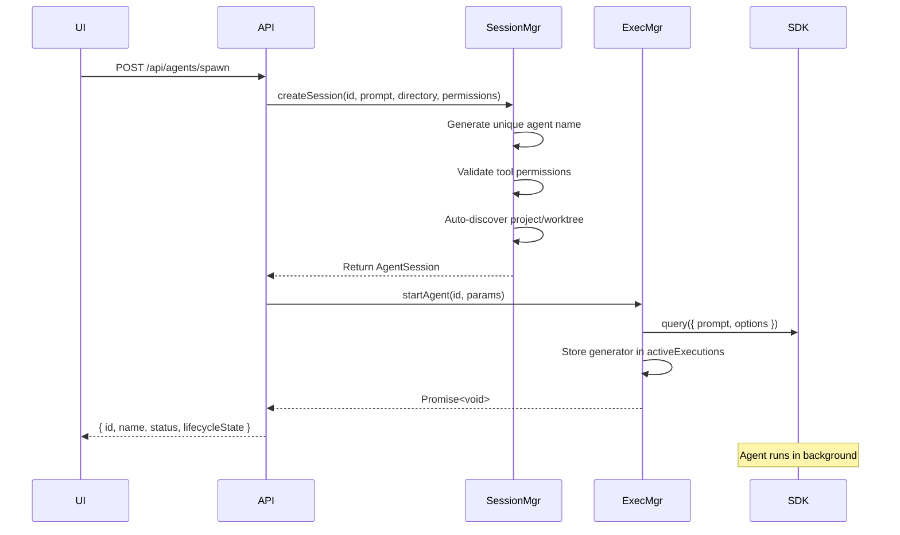

### Real-Time Streaming Flow

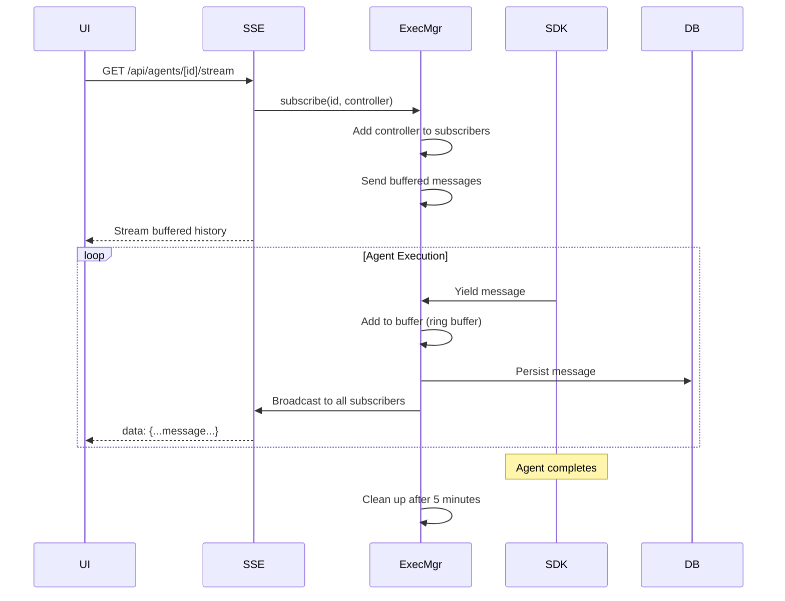

### Tool Permission Approval Flow

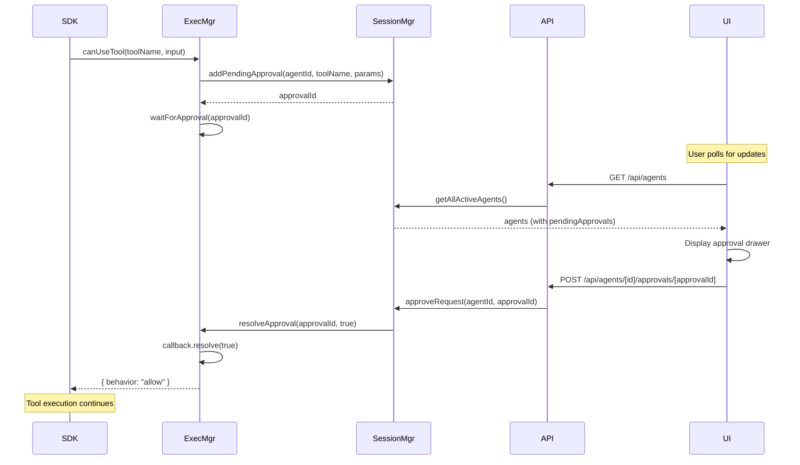

### Project Discovery Flow

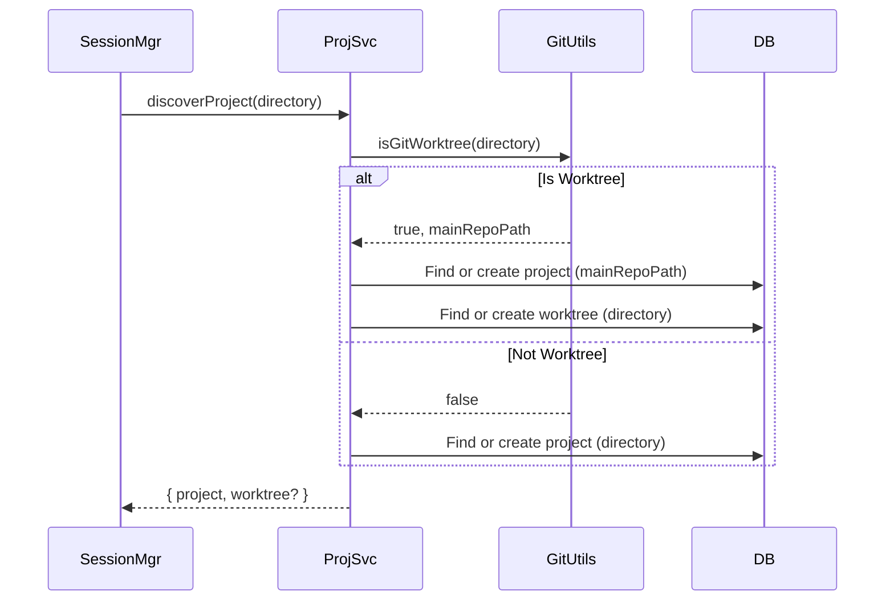

### Session Management Flows

#### Session Capture Flow

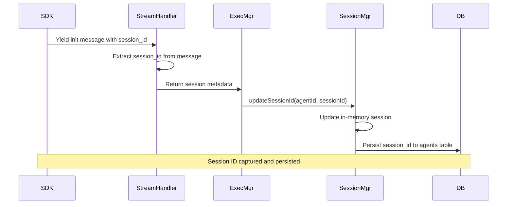

#### Reply Flow (Conversation Continuation)

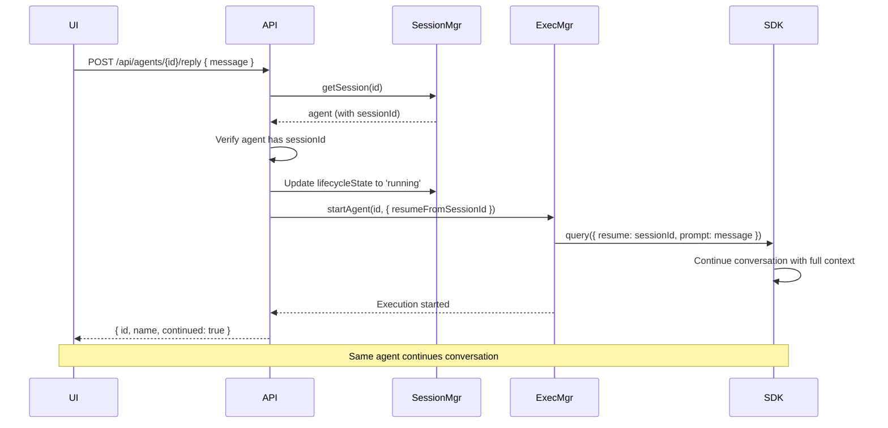

#### Fork Flow (Conversation Branching)

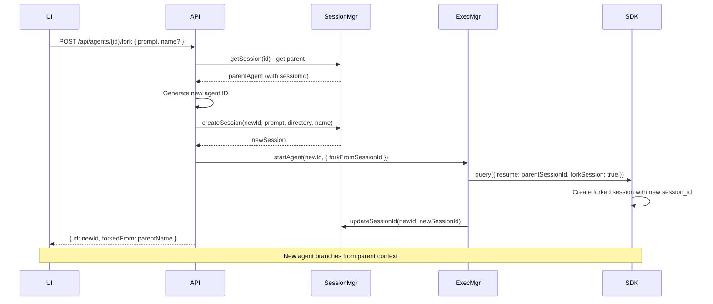

#### Pause/Resume Flow (SDK Session-Based)

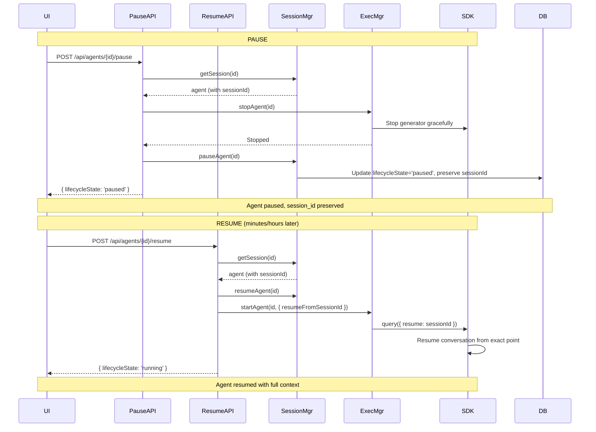

---

## Technology Stack

### Core Framework
- **Next.js 15** (App Router) - React meta-framework with server-side rendering
- **React 19** - UI library with concurrent features
- **TypeScript 5** - Type-safe JavaScript

### Styling & UI
- **Tailwind CSS 4** - Utility-first CSS framework
- **PostCSS** - CSS transformations
- **React Markdown** - Markdown rendering
- **React Syntax Highlighter** - Code syntax highlighting

### Backend & Data
- **Better SQLite3** - Embedded SQL database for persistence
- **Claude Agent SDK** (`@anthropic-ai/claude-agent-sdk`) - AI agent orchestration
- **Gray Matter** - YAML frontmatter parsing
- **Zod** - Runtime type validation and schema parsing

### Development Tools
- **ESLint 9** - Code linting
- **Bun / Node.js 18+** - Runtime environments

### External APIs
- **Anthropic API** - Claude model access (via SDK)
- **OpenSpec CLI** - Spec-driven development tools

---

## Directory Structure

```
agent-view/
├── .claude/                    # Claude Code slash commands
│   └── commands/
├── .next/                      # Next.js build output (gitignored)
├── docs/                       # Documentation
│   ├── ARCHITECTURE.md         # This file
│   ├── analysis/               # Design analysis documents
│   ├── reviews/                # Code review artifacts
│   └── openspec-integration.md # OpenSpec integration guide
├── node_modules/               # Dependencies (gitignored)
├── openspec/                   # OpenSpec project files
│   ├── project.md              # Project conventions
│   ├── AGENTS.md               # AI assistant instructions
│   └── [specs/changes/archive]/
├── public/                     # Static assets
│   ├── favicon.ico
│   └── [images]
├── src/                        # Application source code
│   ├── app/                    # Next.js App Router
│   │   ├── api/                # API routes
│   │   │   ├── agents/         # Agent management endpoints
│   │   │   │   ├── route.ts                    # GET all active agents
│   │   │   │   ├── spawn/route.ts              # POST spawn new agent
│   │   │   │   ├── history/route.ts            # GET agent history
│   │   │   │   └── [id]/                       # Single agent operations
│   │   │   │       ├── stream/route.ts         # SSE stream endpoint
│   │   │   │       ├── status/route.ts         # GET agent status
│   │   │   │       ├── pause/route.ts          # POST pause agent
│   │   │   │       ├── resume/route.ts         # POST resume agent
│   │   │   │       ├── stop/route.ts           # POST stop agent
│   │   │   │       ├── restart/route.ts        # POST restart agent
│   │   │   │       ├── rename/route.ts         # PATCH rename agent
│   │   │   │       ├── reply/route.ts          # POST reply to agent (session)
│   │   │   │       ├── fork/route.ts           # POST fork agent (session)
│   │   │   │       └── approvals/              # Tool permission approvals
│   │   │   │           ├── route.ts            # GET pending approvals
│   │   │   │           └── [approvalId]/route.ts # POST approve/deny
│   │   │   ├── configs/        # Agent configuration presets
│   │   │   │   ├── route.ts                    # GET/POST configs
│   │   │   │   ├── recent/route.ts             # GET recent configs
│   │   │   │   ├── migrate/route.ts            # POST migrate configs
│   │   │   │   └── [id]/route.ts               # GET/PUT/DELETE config
│   │   │   ├── openspec/       # OpenSpec integration
│   │   │   ├── projects/       # Project management
│   │   │   │   ├── route.ts                    # GET/POST projects
│   │   │   │   └── [id]/route.ts               # GET/PUT/DELETE project
│   │   │   ├── worktrees/      # Git worktree management
│   │   │   │   ├── route.ts                    # GET/POST worktrees
│   │   │   │   └── [id]/route.ts               # GET/PUT/DELETE worktree
│   │   │   └── slash-command/  # OpenSpec CLI wrapper
│   │   │       └── route.ts
│   │   ├── projects/           # Project detail pages
│   │   │   └── [id]/page.tsx
│   │   ├── layout.tsx          # Root layout with providers
│   │   ├── page.tsx            # Main dashboard
│   │   ├── globals.css         # Global styles
│   │   └── favicon.ico
│   ├── components/             # React components
│   │   ├── features/           # Feature-specific components
│   │   │   ├── active-agents-dashboard.tsx
│   │   │   ├── agent-card.tsx
│   │   │   ├── agent-history-list.tsx
│   │   │   ├── agent-interaction-modal.tsx
│   │   │   ├── agent-output-stream.tsx
│   │   │   ├── agent-spawn-modal.tsx
│   │   │   ├── agent-status-badge.tsx
│   │   │   ├── help-modal.tsx
│   │   │   ├── permission-approval-drawer.tsx
│   │   │   └── projects-dashboard.tsx
│   │   ├── openspec/           # OpenSpec viewer components
│   │   │   ├── openspec-modal.tsx
│   │   │   ├── capability-card.tsx
│   │   │   ├── change-card.tsx
│   │   │   ├── archive-card.tsx
│   │   │   ├── validation-panel.tsx
│   │   │   ├── markdown-renderer.tsx
│   │   │   └── [other spec viewers]
│   │   └── ui/                 # Reusable UI primitives
│   │       ├── button.tsx
│   │       ├── card.tsx
│   │       ├── input.tsx
│   │       ├── badge.tsx
│   │       └── [other primitives]
│   ├── contexts/               # React Context providers
│   │   └── active-agents-context.tsx
│   ├── hooks/                  # Custom React hooks
│   │   ├── use-agent-history.ts
│   │   ├── use-agent-lifecycle.ts
│   │   ├── use-agent-stream.ts
│   │   └── use-keyboard-shortcuts.tsx
│   ├── lib/                    # Core business logic
│   │   ├── agent-execution-manager.ts
│   │   ├── agent-session-manager.ts
│   │   ├── agent-names.ts
│   │   ├── agent-templates.ts
│   │   ├── tool-permissions.ts
│   │   ├── agent-sdk/          # Claude SDK integration
│   │   │   ├── client.ts
│   │   │   ├── stream-handler.ts
│   │   │   └── types.ts
│   │   ├── database/           # SQLite persistence layer
│   │   │   ├── client.ts
│   │   │   ├── schema.ts
│   │   │   ├── index.ts
│   │   │   └── repositories/
│   │   │       ├── agents.ts
│   │   │       ├── messages.ts
│   │   │       ├── projects.ts
│   │   │       ├── worktrees.ts
│   │   │       └── agent-configs.ts
│   │   ├── git/                # Git utilities
│   │   │   └── worktree-utils.ts
│   │   ├── openspec/           # OpenSpec integration
│   │   │   ├── parser.ts
│   │   │   ├── fs-operations.ts
│   │   │   └── cli-wrapper.ts
│   │   └── services/           # Domain services
│   │       └── project-discovery.ts
│   ├── types/                  # TypeScript type definitions
│   │   ├── agent.ts
│   │   ├── project.ts
│   │   └── openspec.ts
│   └── instrumentation.ts      # Next.js instrumentation hooks
├── package.json                # Dependencies and scripts
├── package-lock.json           # Dependency lock file
├── tsconfig.json               # TypeScript configuration
├── next.config.ts              # Next.js configuration
├── postcss.config.mjs          # PostCSS configuration
├── eslint.config.mjs           # ESLint configuration
├── .gitignore                  # Git ignore patterns
├── LICENSE                     # WTFPL license
└── README.md                   # Project overview
```

### Key Directories Explained

- **`src/app/api/`**: Next.js API routes that handle HTTP requests and return JSON/SSE responses
- **`src/lib/`**: Pure TypeScript business logic, independent of framework (Next.js/React)
- **`src/components/`**: React components organized by feature and reusability
- **`src/contexts/`**: React Context providers for global state (agents, auth, etc.)
- **`src/hooks/`**: Custom React hooks for reusable component logic
- **`src/types/`**: Shared TypeScript type definitions used across the app

---

## API Contracts

### Agent Management API

#### Spawn Agent
```typescript
POST /api/agents/spawn
Request: {
  prompt: string;              // Task description
  directory: string;           // Working directory path
  name?: string;               // Custom agent name (optional)
  toolPermissions?: {
    preset: 'read-only' | 'standard' | 'full-access' | 'custom';
    tools?: ToolName[];        // Required if preset === 'custom'
  };
}
Response: {
  id: string;                  // Unique agent ID
  name: string;                // Generated or custom name
  status: AgentStatus;         // 'running'
  lifecycleState: AgentLifecycleState; // 'running'
  toolPermissions: ToolPermission;
}
```

#### Get Active Agents
```typescript
GET /api/agents
Response: {
  agents: Array<{
    id: string;
    name: string;
    prompt: string;
    directory: string;
    status: AgentStatus;
    lifecycleState: AgentLifecycleState;
    toolPermissions: ToolPermission;
    projectId?: string;
    worktreeId?: string;
    startTime: number;
    endTime?: number;
    pausedTime?: number;
    messages: AgentMessage[];
    pendingApprovals?: PendingApproval[];
    metrics?: {
      elapsedTime: number;
      messageCount: number;
      lastActivityTime: number;
    };
  }>;
}
```

#### Stream Agent Output
```typescript
GET /api/agents/[id]/stream
Response: Server-Sent Events (text/event-stream)
  data: {
    type: 'assistant' | 'tool_use' | 'tool_result' | 'result' | 'error';
    content: string;
    timestamp: number;
    toolName?: string;
    toolParams?: Record<string, unknown>;
  }
```

#### Agent Lifecycle Control
```typescript
POST /api/agents/[id]/pause
Response: {
  id: string;
  lifecycleState: 'paused';
  pausedTime: number;
  sessionId?: string;
}

POST /api/agents/[id]/resume
Request: { message?: string }  // Optional continuation message
Response: {
  id: string;
  lifecycleState: 'running';
  sessionId?: string;
  resumed: boolean;
}

POST /api/agents/[id]/stop
Response: { success: boolean }

POST /api/agents/[id]/restart
Request: { prompt?: string; directory?: string; toolPermissions?: ToolPermission }
Response: { id: string; name: string; status: AgentStatus }

PATCH /api/agents/[id]/rename
Request: { name: string }
Response: { success: boolean; name: string }
```

#### Session Management (Conversational AI)
```typescript
POST /api/agents/[id]/reply
Request: { message: string }
Response: {
  id: string;                  // Same agent ID (continuation)
  name: string;                // Same agent name
  status: 'running';
  lifecycleState: 'running';
  sessionId: string;
  continued: true;             // Flag indicating conversation continuation
}
Error (400): "Agent does not have an SDK session ID"
Error (409): "Agent is currently running. Please wait for completion."

POST /api/agents/[id]/fork
Request: {
  prompt: string;              // New direction for forked conversation
  name?: string;               // Optional custom name for fork
}
Response: {
  id: string;                  // New agent ID (independent branch)
  name: string;                // New agent name (e.g., "original-name - fork")
  status: 'running';
  lifecycleState: 'running';
  toolPermissions: ToolPermission;
  parentAgentId: string;       // Reference to parent agent
  forkedFrom: string;          // Parent agent name
}
Error (400): "Agent does not have an SDK session ID"
```

#### Tool Permission Approvals
```typescript
GET /api/agents/[id]/approvals
Response: {
  approvals: Array<{
    id: string;
    toolName: ToolName;
    description: string;
    params: Record<string, unknown>;
    timestamp: number;
  }>;
}

POST /api/agents/[id]/approvals/[approvalId]
Request: { approved: boolean }
Response: { success: boolean }
```

#### Agent History
```typescript
GET /api/agents/history
Response: {
  history: Array<{
    id: string;
    name: string;
    prompt: string;
    directory: string;
    status: AgentStatus;
    toolPermissions: ToolPermission;
    startTime: number;
    endTime?: number;
    messageCount: number;
  }>;
}
```

### Project Management API

#### List/Create Projects
```typescript
GET /api/projects
Response: {
  projects: Project[];
}

POST /api/projects
Request: {
  name: string;
  directory: string;
  description?: string;
  openspecPath?: string;
  defaultToolPermissions?: Record<string, any>;
  isFavorite?: boolean;
  tags?: string[];
}
Response: Project
```

#### Project Details
```typescript
GET /api/projects/[id]
Response: {
  project: Project;
  worktrees: Worktree[];
  agents: AgentSession[];
}

PUT /api/projects/[id]
Request: UpdateProjectInput
Response: Project

DELETE /api/projects/[id]
Response: { success: boolean }
```

### Configuration API

#### Agent Configurations
```typescript
GET /api/configs
Response: { configs: AgentConfig[] }

POST /api/configs
Request: {
  name: string;
  prompt: string;
  directory: string;
  toolPreset: ToolPermissionPreset;
  customTools?: string[];
  isFavorite?: boolean;
  tags?: string[];
}
Response: AgentConfig

GET /api/configs/recent
Response: { configs: AgentConfig[] }
```

### OpenSpec API

#### Run OpenSpec Commands
```typescript
POST /api/slash-command
Request: {
  command: string;             // e.g., "list", "show", "validate"
  args?: string[];
}
Response: {
  output: string;
  exitCode: number;
}
```

---

## Database Schema

### Schema Version: 4

Agent View uses **SQLite** for optional persistence. If `ENABLE_DATABASE` environment variable is not set, the system operates entirely in-memory.

**Migration History:**
- **v1**: Initial schema (projects, worktrees, agents, messages, agent_configs, settings)
- **v2**: Added project and worktree management fields
- **v3**: Added agent naming and tool permissions
- **v4**: Added `session_id` column to agents table for SDK session management

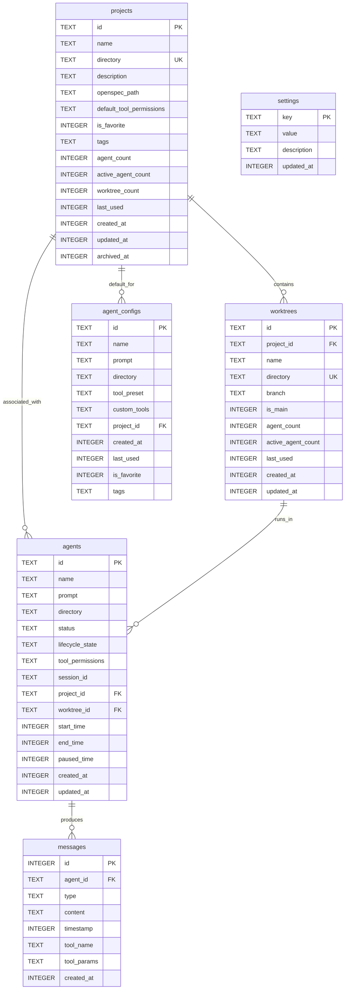

### Table Descriptions

**projects**
- Represents software projects (git repositories)
- Auto-discovered when agents are spawned
- Tracks agent usage statistics

**worktrees**
- Represents git worktrees within a project
- Auto-discovered via `git worktree list`
- Links agents to specific branches/worktrees

**agents**
- Agent session records with lifecycle state
- References project and worktree for organizational context
- Stores tool permissions as JSON
- **session_id**: Claude SDK session identifier for reply/fork/resume (nullable for legacy agents)

**messages**
- Agent output messages (assistant, tool_use, tool_result, error, result)
- Limited to last 1000 messages per agent (ring buffer)
- Supports late subscriber replay

**agent_configs**
- Saved agent configuration presets
- Allows quick re-spawning with same settings
- Tracks usage frequency

**settings**
- Application-wide settings
- Includes schema version for migrations

### Indexes

```sql
-- agents
CREATE INDEX idx_agents_status ON agents(status);
CREATE INDEX idx_agents_lifecycle ON agents(lifecycle_state);
CREATE INDEX idx_agents_start_time ON agents(start_time DESC);
CREATE INDEX idx_agents_project_id ON agents(project_id);
CREATE INDEX idx_agents_worktree_id ON agents(worktree_id);
CREATE INDEX idx_agents_session_id ON agents(session_id);

-- messages
CREATE INDEX idx_messages_agent_id ON messages(agent_id);
CREATE INDEX idx_messages_timestamp ON messages(timestamp);
CREATE INDEX idx_messages_type ON messages(type);

-- projects
CREATE INDEX idx_projects_directory ON projects(directory);
CREATE INDEX idx_projects_last_used ON projects(last_used DESC);
CREATE INDEX idx_projects_favorite ON projects(is_favorite DESC, last_used DESC);
CREATE INDEX idx_projects_archived ON projects(archived_at);

-- worktrees
CREATE INDEX idx_worktrees_project_id ON worktrees(project_id);
CREATE INDEX idx_worktrees_directory ON worktrees(directory);
CREATE INDEX idx_worktrees_last_used ON worktrees(last_used DESC);
CREATE INDEX idx_worktrees_is_main ON worktrees(is_main DESC);

-- agent_configs
CREATE INDEX idx_configs_last_used ON agent_configs(last_used DESC);
CREATE INDEX idx_configs_favorite ON agent_configs(is_favorite DESC, last_used DESC);
CREATE INDEX idx_configs_project_id ON agent_configs(project_id);
```

### Migration Strategy

- Schema version tracked in `settings` table
- Incremental migrations run on startup
- Transaction-based for atomicity
- Graceful degradation if database is unavailable

---

## Key Design Decisions

### 1. Publisher-Subscriber Pattern for Agent Output

**Decision**: Implement pub/sub with message buffering instead of direct streaming.

**Rationale**:
- Agents run in background, independent of active stream connections
- Multiple clients can subscribe to same agent simultaneously
- Late subscribers receive buffered message history (last 1000 messages)
- Enables reconnection without missing output
- Supports mobile use case (network interruptions)

**Trade-offs**:
- Increased memory usage (1000 messages × 20 agents = up to 20k messages in memory)
- Complexity in managing subscriber lifecycle
- Benefit: Reliability and flexibility outweigh memory cost

### 2. Singleton Managers with Hot-Reload Preservation

**Decision**: Use singleton instances stored on `globalThis` in development.

**Rationale**:
- Next.js dev mode hot-reloads modules, which would create new instances
- Agent state must persist across hot reloads to prevent orphaned generators
- Singleton pattern ensures one source of truth for agent state

**Implementation**:
```typescript
const globalForManager = globalThis as { manager: Manager | undefined };
export const manager = globalForManager.manager ?? new Manager();
if (process.env.NODE_ENV !== 'production') {
  globalForManager.manager = manager;
}
```

### 3. Optional Database Persistence

**Decision**: Make SQLite database optional, default to in-memory state.

**Rationale**:
- Simplifies initial setup (no database configuration required)
- Reduces dependencies for users who only need temporary sessions
- Database enables persistence for production/long-term use
- Graceful degradation: operations continue if database fails

**Trade-off**: In-memory mode loses state on restart (acceptable for development).

### 4. Concurrent Agent Limit (20 Max)

**Decision**: Hard limit of 20 concurrent agents.

**Rationale**:
- Claude API has rate limits per API key
- Each agent holds an open generator/stream connection
- Memory usage scales linearly with active agents
- 20 is sufficient for realistic multi-agent workflows

**Future**: Make configurable via settings table.

### 5. Tool Permission Presets + Custom Mode

**Decision**: Offer 3 presets (read-only, standard, full-access) plus custom mode.

**Rationale**:
- Simplifies common use cases (most users use standard)
- Custom mode provides flexibility for advanced users
- Presets prevent accidental dangerous operations
- SDK's `canUseTool` callback enables granular runtime approval

**Presets**:
- **Read-only**: Read, Grep, Glob, WebFetch, WebSearch
- **Standard**: Read-only + Edit, TodoWrite
- **Full-access**: All tools (including Write, Bash, Task)

### 6. Auto-Discovery of Projects and Worktrees

**Decision**: Automatically detect projects and worktrees from agent directory.

**Rationale**:
- Reduces manual project setup
- Provides organizational context automatically
- Enables project-wide agent statistics
- Supports git worktree workflows (multiple branches)

**Implementation**:
```typescript
// On agent spawn:
const discovery = await discoverProject(directory);
session.projectId = discovery.project.id;
session.worktreeId = discovery.worktree?.id;
```

### 7. React Context for State Management (Not Redux/Zustand)

**Decision**: Use React Context + hooks for client state.

**Rationale**:
- Simpler mental model (no external state library)
- Sufficient for current complexity (2-3 contexts)
- Polling-based updates (2s interval) fit Context model
- No need for advanced features (time travel, middleware)

**Trade-off**: May need refactor if state complexity increases significantly.

### 8. Server-Sent Events (SSE) for Streaming

**Decision**: Use SSE instead of WebSockets for agent output streaming.

**Rationale**:
- SSE is simpler (HTTP-based, no protocol upgrade)
- Automatically reconnects on connection drop
- Sufficient for unidirectional streaming (server → client)
- Works through most proxies and firewalls
- Built-in browser support (EventSource API)

**Trade-off**: No bidirectional communication (acceptable for read-only streams).

### 9. Agent Names with Auto-Generation

**Decision**: Generate agent names from adjective-noun pairs if not provided.

**Rationale**:
- Human-friendly identifiers (easier than UUIDs in UI)
- Reduces cognitive load when managing multiple agents
- Uniqueness enforced with numeric suffix if needed
- Users can override with custom names

**Examples**: "swift-falcon", "quiet-river-2", "brave-phoenix"

### 10. Message Retention: Ring Buffer + Database

**Decision**: Keep last 1000 messages in memory, all in database (if enabled).

**Rationale**:
- Memory: Ring buffer prevents unbounded growth
- Database: Persistent storage for historical analysis
- 1000 messages ≈ 10-30 minutes of agent activity (sufficient for reconnection)
- Database queries limited to 1000 messages for performance

**Trade-off**: Very long-running agents lose early messages from buffer (acceptable).

### 11. SDK Session Management for Conversational Workflows

**Decision**: Capture and persist Claude SDK session IDs to enable reply, fork, and true pause/resume.

**Rationale**:
- **Reply**: Enables follow-up messages to agents without creating new instances (conversational continuity)
- **Fork**: Allows branching conversations to explore alternatives while preserving original context
- **Pause/Resume**: JavaScript generators can't be suspended, but SDK sessions enable context-preserving restart
- **Backward compatible**: Nullable `session_id` column, legacy agents continue working
- **Persistence**: Sessions can be resumed even after server restarts

**Semantic Boundaries**:
- **Reply**: Same agent, same ID, same name → continues conversation
- **Fork**: New agent, new ID, new name → branches conversation
- **Resume**: Same agent, same ID, same name → restarts paused work

**Trade-offs**:
- Session expiration: SDK may expire sessions after inactivity (mitigated with error handling)
- Generator restart delay: 1-2s to restart generator on resume (acceptable for human-scale pauses)
- Cannot pause mid-tool-execution: Must wait for tool completion (30s timeout before force-stop)

**Implementation Note**: Current version blocks concurrent replies (409 Conflict). Message queuing is deferred as future enhancement.

---

## Deployment Architecture

### Local Development

```
┌─────────────────────────────────────────────┐
│           Developer Machine                  │
│                                              │
│  ┌──────────────────────────────────────┐  │
│  │   Next.js Dev Server (localhost:3000) │  │
│  │   - Hot reload enabled               │  │
│  │   - SQLite DB (optional)             │  │
│  └──────────────────────────────────────┘  │
│            │                                 │
│            ↓                                 │
│  ┌──────────────────────────────────────┐  │
│  │   Claude Agent SDK                    │  │
│  │   - Detects local Claude Code        │  │
│  │   - Spawns agents in subprocesses    │  │
│  └──────────────────────────────────────┘  │
│            │                                 │
└────────────┼─────────────────────────────────┘
             │
             ↓
    ┌────────────────────┐
    │  Anthropic API     │
    │  (claude-3.7-sonnet)│
    └────────────────────┘
```

**Access**: `http://localhost:3000`

### Production Deployment (Self-Hosted)

```
┌─────────────────────────────────────────────────────┐
│              Home Network (192.168.1.0/24)          │
│                                                     │
│  ┌──────────────────────────────────────────────┐ │
│  │   Server (Raspberry Pi / NUC / Cloud VM)     │ │
│  │                                              │ │
│  │   Next.js Production Build                  │ │
│  │   - npm run build && npm start              │ │
│  │   - SQLite DB enabled                       │ │
│  │   - Port 3000                               │ │
│  └──────────────────────────────────────────────┘ │
│            │                                        │
└────────────┼────────────────────────────────────────┘
             │
             ↓
    ┌─────────────────────┐
    │  Reverse Proxy       │
    │  (Nginx / Caddy)     │
    │  - HTTPS termination │
    │  - Auth middleware   │
    └─────────────────────┘
             │
             ↓
    ┌─────────────────────┐
    │  Tailscale VPN       │
    │  (Secure access)     │
    └─────────────────────┘
             │
             ↓
    📱 Mobile Device
    (Smartphone / Tablet)
```

**Access**: `https://agent-view.tailnet-name.ts.net`

### Environment Variables

```bash
# Required
ANTHROPIC_API_KEY=sk-ant-...       # Claude API key

# Optional
ENABLE_DATABASE=true                # Enable SQLite persistence
DATABASE_PATH=/data/agent-view.db   # Custom database location
PORT=3000                           # Server port
NODE_ENV=production                 # Environment mode
```

### Security Considerations

⚠️ **IMPORTANT**: Agent View is designed for **local/private network use only**.

**Do NOT expose directly to the public internet** because:
1. No built-in authentication (relies on network-level access control)
2. Agents have file system access (Read, Write, Bash tools)
3. Claude API key is stored in environment (no per-user auth)
4. No rate limiting or abuse prevention

**Recommended Security**:
- Use **Tailscale** or similar VPN for remote access
- Add **reverse proxy with basic auth** (Nginx/Caddy)
- Use **firewall rules** to restrict access to trusted IPs
- Run in **Docker container** with limited permissions
- Set **tool permission presets** to read-only/standard by default

### Scaling Limitations

Current architecture is **single-instance only**:
- In-memory state (agents, subscribers) not shared across processes
- SQLite database is local (no distributed locking)
- No horizontal scaling support

**For multi-user/multi-instance**:
- Migrate to PostgreSQL/MySQL with connection pooling
- Use Redis for pub/sub and distributed locks
- Implement user authentication and API key management
- Add load balancer with sticky sessions (or refactor to stateless)

### Backup Strategy

**Database**:
```bash
# SQLite backup (if enabled)
sqlite3 agent-view.db ".backup agent-view-backup.db"
```

**Configuration**:
- Agent configs stored in database (included in backup)
- OpenSpec files stored in `openspec/` directory (commit to git)

---

## Appendix: Key Files Reference

### Entry Points
- `src/app/layout.tsx` - Root layout with providers
- `src/app/page.tsx` - Main dashboard page
- `src/instrumentation.ts` - Database initialization on startup

### State Management
- `src/lib/agent-session-manager.ts` - Agent session lifecycle
- `src/lib/agent-execution-manager.ts` - Background execution orchestration
- `src/contexts/active-agents-context.tsx` - React context for UI state

### API Layer
- `src/app/api/agents/spawn/route.ts` - Agent creation endpoint
- `src/app/api/agents/[id]/stream/route.ts` - SSE streaming endpoint
- `src/app/api/agents/[id]/stop/route.ts` - Agent termination endpoint

### Database
- `src/lib/database/schema.ts` - Table definitions and migrations
- `src/lib/database/repositories/agents.ts` - Agent data access
- `src/lib/database/repositories/messages.ts` - Message data access

### Claude SDK Integration
- `src/lib/agent-sdk/client.ts` - SDK query wrapper
- `src/lib/agent-sdk/stream-handler.ts` - Message stream parser

---

**Document Version**: 1.1
**Last Updated**: 2025-01-14
**Schema Version**: 4
**Application Version**: 0.2.0
