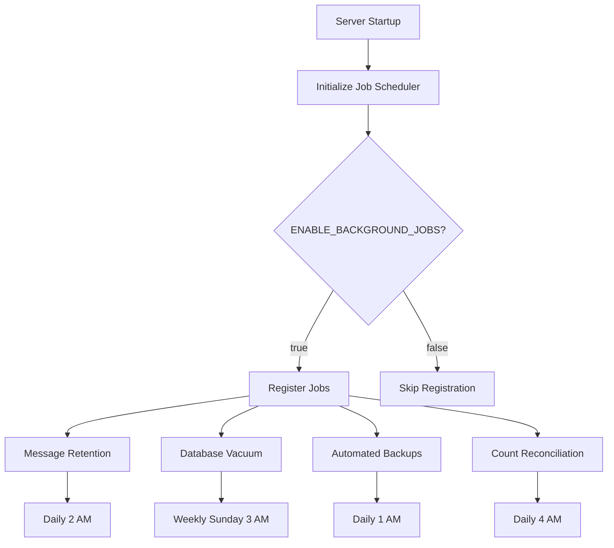

# Documentation Plan for Production Readiness

## Current State Analysis

### Existing Documentation (✅ Good Coverage)

**README.md**
- ✅ Overview and features
- ✅ Setup instructions
- ✅ Basic architecture
- ✅ OpenSpec integration
- ✅ Roadmap
- ✅ Security considerations
- ❌ **MISSING**: Database persistence details
- ❌ **MISSING**: Environment variables reference
- ❌ **MISSING**: Operational procedures (backup, restore, troubleshooting)

**docs/ARCHITECTURE.md** (Comprehensive - 1334 lines)
- ✅ System overview
- ✅ High-level architecture
- ✅ Component architecture with Mermaid diagrams
- ✅ Data flow diagrams (spawning, streaming, approvals, project discovery, session management)
- ✅ Technology stack
- ✅ Complete directory structure
- ✅ API contracts (detailed)
- ✅ Database schema (v4) with ER diagram
- ✅ Key design decisions (11 major decisions documented)
- ✅ Deployment architecture
- ❌ **MISSING**: Background jobs section
- ❌ **MISSING**: Health monitoring section
- ❌ **MISSING**: Automated maintenance procedures

**docs/openspec-integration.md**
- ✅ OpenSpec workflow documentation

---

## Documentation Updates Required

### 1. README.md Updates

Add the following sections:

#### 1.1 Database & Persistence Section

```markdown
## Database & Persistence

Agent View uses SQLite for optional persistence. When enabled, the application survives restarts and maintains full session history.

### Database Location

By default: `~/.config/agent-view/database.sqlite`

Custom location: Set `DATABASE_PATH` environment variable

### Features Persisted

- **Agent sessions**: All agent metadata, status, and lifecycle state
- **Message history**: Complete conversation history for all agents
- **Projects & worktrees**: Auto-discovered project organization
- **Agent configurations**: Saved presets for quick re-spawning
- **OpenSpec cache**: Synced specifications and changes

### Session Recovery

On application startup, Agent View automatically restores active agents from the database:
- Agents appear in the UI with their last known status
- Message history is available for viewing
- Agents do NOT resume execution automatically (manual resume required)

Enable/disable session recovery:
```bash
ENABLE_SESSION_RECOVERY=false  # Default: true
```

### Backup & Restore

**Manual Backup:**
```bash
cp ~/.config/agent-view/database.sqlite ~/backups/agent-view-$(date +%Y%m%d).db
```

**Automated Backups:**
Background jobs automatically create daily backups (see Background Jobs section)

**Restore from Backup:**
```bash
# Stop the application
cp ~/backups/agent-view-20250113.db ~/.config/agent-view/database.sqlite
# Restart the application
```

### Database Reset

If you encounter database corruption:
```bash
# DANGER: This deletes all data
rm ~/.config/agent-view/database.sqlite
# Restart application to create fresh database
```
```

#### 1.2 Environment Variables Section

```markdown
## Environment Variables

### Required

```bash
# Claude API access (required for agent execution)
ANTHROPIC_API_KEY=sk-ant-...
```

### Optional - Database

```bash
# Enable/disable SQLite persistence (default: true)
ENABLE_PERSISTENCE=true

# Custom database location (default: ~/.config/agent-view/database.sqlite)
DATABASE_PATH=/custom/path/database.sqlite

# Enable/disable session recovery on startup (default: true)
ENABLE_SESSION_RECOVERY=true

# Enable/disable background maintenance jobs (default: true)
ENABLE_BACKGROUND_JOBS=true

# Message retention period in days (default: 30)
MESSAGE_RETENTION_DAYS=30
```

### Optional - Server

```bash
# Server port (default: 3000)
PORT=3000

# Node environment (default: development)
NODE_ENV=production
```
```

#### 1.3 Troubleshooting Section

```markdown
## Troubleshooting

### Database Issues

**Symptom**: "Database is locked" errors
- **Cause**: Another process is accessing the database
- **Solution**: Stop all instances of Agent View, then restart

**Symptom**: "Database is corrupted" errors
- **Cause**: Unexpected shutdown or filesystem issues
- **Solution**: Restore from backup or reset database (see Database & Persistence)

**Symptom**: Agents not appearing after restart
- **Cause**: Session recovery disabled or database unavailable
- **Solution**: Check `ENABLE_SESSION_RECOVERY` and `ENABLE_PERSISTENCE` environment variables

### Performance Issues

**Symptom**: Slow UI or high memory usage
- **Cause**: Too many active agents or large message buffers
- **Solution**:
  - Stop inactive agents
  - Reduce `MESSAGE_RETENTION_DAYS` to clean old messages
  - Restart application to clear memory

### Agent Issues

**Symptom**: Agent stuck in "running" state
- **Cause**: Agent waiting for tool approval or API timeout
- **Solution**: Check permission approval drawer or stop/restart agent

**Symptom**: Cannot spawn new agents (limit reached)
- **Cause**: 20 concurrent agent limit enforced
- **Solution**: Stop or complete some agents before spawning new ones

### API Connection Issues

**Symptom**: "Failed to fetch" errors
- **Cause**: Anthropic API key invalid or rate limited
- **Solution**: Verify `ANTHROPIC_API_KEY` and check API usage limits

### Background Jobs

**Symptom**: Database growing too large
- **Cause**: Background jobs disabled or message retention too long
- **Solution**:
  - Enable background jobs: `ENABLE_BACKGROUND_JOBS=true`
  - Reduce retention: `MESSAGE_RETENTION_DAYS=7`
  - Manual cleanup via `/api/admin/reconcile` endpoint
```

---

### 2. docs/ARCHITECTURE.md Updates

Add two new sections after "Key Design Decisions":

#### 2.1 Background Jobs & Automated Maintenance

```markdown
## Background Jobs & Automated Maintenance

### Job Scheduler Architecture

Agent View includes an in-process job scheduler using `node-cron` for automated maintenance tasks. Jobs run alongside the Next.js server and can be controlled via environment variables.



### Scheduled Jobs

#### 1. Message Retention Cleanup
- **Schedule**: Daily at 2:00 AM (server timezone)
- **Purpose**: Delete messages older than retention period
- **Configuration**: `MESSAGE_RETENTION_DAYS` (default: 30)
- **Impact**: Reduces database size, improves query performance
- **SQL**: `DELETE FROM messages WHERE timestamp < (NOW() - RETENTION_DAYS)`

#### 2. Database Vacuum
- **Schedule**: Weekly on Sunday at 3:00 AM
- **Purpose**: Reclaim space from deleted records, optimize database
- **Configuration**: N/A (automatic)
- **Impact**: Reduces file size, improves read/write performance
- **SQL**: `VACUUM`

#### 3. Automated Backups
- **Schedule**: Daily at 1:00 AM
- **Purpose**: Create dated backup files, rotate old backups
- **Configuration**: Keeps last 7 backups (hardcoded)
- **Location**: `~/.config/agent-view/backups/`
- **Filename**: `database.sqlite.backup-YYYYMMDD`

#### 4. Count Reconciliation
- **Schedule**: Daily at 4:00 AM
- **Purpose**: Fix drifted agent/worktree counts in projects table
- **Configuration**: N/A (automatic)
- **Impact**: Ensures accurate statistics in Projects Dashboard
- **Details**: Reconciles `agent_count`, `active_agent_count`, `worktree_count`

### Job Execution Safety

**Concurrent Execution Prevention**: Each job has a lock to prevent overlapping runs
**Error Handling**: Job failures are logged but don't crash the server
**Graceful Degradation**: If database is unavailable, jobs skip and retry next cycle

### Manual Job Triggers

Jobs can be manually triggered via API endpoints (useful for testing or immediate cleanup):

```bash
# Trigger count reconciliation
curl -X POST http://localhost:3000/api/admin/reconcile

# Trigger for specific project
curl -X POST http://localhost:3000/api/admin/reconcile \
  -H "Content-Type: application/json" \
  -d '{"projectId": "project-uuid"}'
```

### Disabling Background Jobs

For development or low-resource environments:

```bash
ENABLE_BACKGROUND_JOBS=false
```

**Trade-off**: Manual maintenance required (database vacuum, message cleanup)
```

#### 2.2 Health Monitoring & Observability

```markdown
## Health Monitoring & Observability

### Health Check Endpoint

Agent View provides a health check endpoint for monitoring database and system status.

#### GET /api/health/database

**Purpose**: Check database connectivity, schema version, and entity counts

**Response Format**:
```json
{
  "status": "healthy" | "degraded" | "error",
  "database": {
    "connected": true,
    "schemaVersion": 4,
    "expectedVersion": 4,
    "path": "/Users/user/.config/agent-view/database.sqlite",
    "sizeBytes": 12345678
  },
  "lastMaintenance": {
    "vacuum": "2025-10-06T03:00:00Z",
    "backup": "2025-10-13T01:00:00Z"
  },
  "entities": {
    "agents": 42,
    "projects": 8,
    "worktrees": 12,
    "messages": 15234,
    "openspecEntities": 87
  }
}
```

**Status Definitions**:
- **healthy**: Database connected, schema matches, no issues
- **degraded**: Database connected but has warnings (old schema, large size)
- **error**: Database unavailable or corrupted

**Use Cases**:
- UI health indicator (poll every 30s)
- Troubleshooting database issues
- Monitoring dashboard integration

### Logging Strategy

**Startup Logs**:
```
[Instrumentation] Database initialized successfully
[Instrumentation] Database health check: HEALTHY
  - Schema version: 4
[Instrumentation] Session recovery enabled and completed
[AgentSessionManager] Session recovery: Found 3 active agents to restore
[AgentSessionManager] Restored agent swift-falcon (abc123) with 42 messages
[AgentSessionManager] Session recovery complete:
  - Agents restored: 3
  - Agents skipped: 0
```

**Job Execution Logs**:
```
[JobScheduler] Message retention job started
[JobScheduler] Deleted 1,234 messages older than 30 days
[JobScheduler] Message retention job completed in 152ms

[JobScheduler] Database vacuum started
[JobScheduler] Vacuum completed in 3.2s, reclaimed 45MB
```

**Error Logs**:
```
[AgentSessionManager] Failed to hydrate from database: SQLITE_BUSY
[JobScheduler] Backup job failed: Disk space insufficient
```

### Observability Best Practices

**For Local Development**:
- Monitor browser console for client errors
- Check terminal logs for server errors
- Use `/api/health/database` to verify setup

**For Production Use**:
- Set up log aggregation (journalctl, Docker logs)
- Monitor health endpoint every 1-5 minutes
- Alert on `status: "error"` responses
- Track database size growth over time
```

---

### 3. NEW: docs/API.md

Create comprehensive API reference document (see outline below)

### 4. NEW: docs/OPERATIONS.md

Create operational procedures guide (see outline below)

---

## New Documentation Files

### docs/API.md Structure

```markdown
# API Reference

## Table of Contents
1. Agent Management API
2. Agent Lifecycle API
3. Agent Session API (Reply, Fork)
4. Tool Permission Approval API
5. Project Management API
6. Worktree Management API
7. Agent Configuration API
8. OpenSpec Integration API
9. Health & Admin API

## For Each Endpoint:
- HTTP method and path
- Description
- Request parameters (query, body)
- Response format (with TypeScript types)
- Example curl commands
- Error responses
- Notes/caveats

## Example Entry:

### Spawn Agent

**Endpoint**: `POST /api/agents/spawn`

**Description**: Create and start a new agent with the specified prompt and directory.

**Request Body**:
```typescript
{
  prompt: string;              // Task description for the agent
  directory: string;           // Working directory path (absolute)
  name?: string;               // Custom agent name (optional, auto-generated if omitted)
  toolPermissions?: {
    preset: 'read-only' | 'standard' | 'full-access' | 'custom';
    tools?: ToolName[];        // Required if preset === 'custom'
  };
}
```

**Response (200 OK)**:
```typescript
{
  id: string;                  // Unique agent ID (UUID)
  name: string;                // Generated or custom name
  status: 'running';           // Initial status
  lifecycleState: 'running';   // Initial lifecycle state
  toolPermissions: {
    preset: string;
    tools: string[];
  };
  projectId?: string;          // Auto-discovered project ID
  worktreeId?: string;         // Auto-discovered worktree ID
}
```

**Example**:
```bash
curl -X POST http://localhost:3000/api/agents/spawn \
  -H "Content-Type: application/json" \
  -d '{
    "prompt": "Review the codebase and suggest improvements",
    "directory": "/Users/user/projects/agent-view",
    "toolPermissions": { "preset": "standard" }
  }'
```

**Errors**:
- `400 Bad Request`: Invalid prompt or directory
- `409 Conflict`: Agent limit reached (20 max)
- `500 Internal Server Error`: Failed to create agent
```

### docs/OPERATIONS.md Structure

```markdown
# Operations Guide

## Daily Operations

### Starting the Application

**Development Mode**:
```bash
npm run dev
# or
bun dev
```
Access at: http://localhost:3000

**Production Mode**:
```bash
npm run build
npm start
```

### Monitoring Health

**Check database health**:
```bash
curl http://localhost:3000/api/health/database | jq
```

**Expected output**:
```json
{
  "status": "healthy",
  "database": {
    "connected": true,
    "schemaVersion": 4,
    ...
  }
}
```

### Managing Agents

**View active agents**:
- UI: Navigate to main dashboard
- API: `curl http://localhost:3000/api/agents`

**Stop all agents** (emergency):
```bash
# Via UI: Use "Stop All" button (if implemented)
# Via API: Stop each agent individually
for id in $(curl -s http://localhost:3000/api/agents | jq -r '.agents[].id'); do
  curl -X POST http://localhost:3000/api/agents/$id/stop
done
```

## Database Management

### Backup Procedures

**Automatic Backups**:
- Enabled by default via background jobs
- Daily at 1:00 AM
- Location: `~/.config/agent-view/backups/`
- Retention: Last 7 backups

**Manual Backup**:
```bash
# SQLite backup (safe, online)
sqlite3 ~/.config/agent-view/database.sqlite ".backup /path/to/backup.db"

# Or simple copy (stop app first)
cp ~/.config/agent-view/database.sqlite ~/backups/agent-view-$(date +%Y%m%d).db
```

**Verify Backup**:
```bash
sqlite3 /path/to/backup.db "SELECT COUNT(*) FROM agents;"
```

### Restore Procedures

**Full Restore**:
```bash
# 1. Stop the application
# 2. Replace database file
cp ~/backups/agent-view-20250113.db ~/.config/agent-view/database.sqlite
# 3. Restart application
# 4. Verify via health check
curl http://localhost:3000/api/health/database
```

**Selective Restore** (advanced):
```bash
# Restore specific table from backup
sqlite3 ~/.config/agent-view/database.sqlite <<EOF
ATTACH DATABASE '~/backups/backup.db' AS backup;
DELETE FROM agents;
INSERT INTO agents SELECT * FROM backup.agents;
DETACH DATABASE backup;
EOF
```

### Database Maintenance

**Manual Vacuum** (reclaim space):
```bash
sqlite3 ~/.config/agent-view/database.sqlite "VACUUM;"
```

**Check Database Size**:
```bash
du -h ~/.config/agent-view/database.sqlite
```

**Analyze Query Performance**:
```bash
sqlite3 ~/.config/agent-view/database.sqlite "ANALYZE;"
```

### Count Reconciliation

If project/worktree counts appear incorrect:

**Manual Trigger**:
```bash
# Reconcile all projects
curl -X POST http://localhost:3000/api/admin/reconcile

# Reconcile specific project
curl -X POST http://localhost:3000/api/admin/reconcile \
  -H "Content-Type: application/json" \
  -d '{"projectId": "project-uuid"}'
```

**Verify Counts**:
```bash
sqlite3 ~/.config/agent-view/database.sqlite <<EOF
SELECT
  p.name,
  p.agent_count,
  (SELECT COUNT(*) FROM agents WHERE project_id = p.id) AS actual_count
FROM projects p;
EOF
```

## Troubleshooting

### Database Corruption

**Symptoms**:
- "database disk image is malformed" errors
- Application crashes on startup
- Health check returns "error" status

**Recovery Steps**:
```bash
# 1. Stop the application

# 2. Try to repair (may not always work)
sqlite3 ~/.config/agent-view/database.sqlite "PRAGMA integrity_check;"

# 3. If corruption detected, restore from backup
cp ~/.config/agent-view/database.sqlite ~/.config/agent-view/database.sqlite.corrupted
cp ~/backups/latest-backup.db ~/.config/agent-view/database.sqlite

# 4. Restart application
```

### High Memory Usage

**Symptoms**:
- Application using >1GB RAM
- System slowdown with many active agents

**Solutions**:
```bash
# 1. Stop inactive agents via UI

# 2. Restart application to clear memory
# (session recovery will restore active agents)

# 3. Reduce message retention
echo "MESSAGE_RETENTION_DAYS=7" >> .env.local
```

### Disk Space Issues

**Check Space**:
```bash
df -h ~/.config/agent-view/
du -sh ~/.config/agent-view/*
```

**Clean Up**:
```bash
# Remove old backups manually
rm ~/.config/agent-view/backups/database.sqlite.backup-2024*

# Reduce message retention and vacuum
sqlite3 ~/.config/agent-view/database.sqlite <<EOF
DELETE FROM messages WHERE timestamp < strftime('%s', 'now', '-7 days');
VACUUM;
EOF
```

## Upgrade Procedures

### Application Updates

```bash
# 1. Backup database
sqlite3 ~/.config/agent-view/database.sqlite ".backup ~/agent-view-pre-upgrade.db"

# 2. Pull latest code
git pull origin main

# 3. Install dependencies
npm install

# 4. Run database migrations (automatic on startup)
npm run build
npm start

# 5. Verify health
curl http://localhost:3000/api/health/database
```

### Schema Migrations

Schema migrations run automatically on startup. Current version: **v4**

**Manual Migration Trigger** (if needed):
```bash
# Migrations run in src/instrumentation.ts on server start
# No manual trigger needed - just restart the application
```

**Rollback** (not supported):
- Restore from pre-upgrade backup
- Migrations are forward-only

## Security Hardening

### Network Security

**Tailscale Setup** (recommended):
```bash
# Install Tailscale
curl -fsSL https://tailscale.com/install.sh | sh

# Connect to your tailnet
sudo tailscale up

# Access Agent View remotely
# Visit: http://machine-name.tailnet-name.ts.net:3000
```

**Firewall Rules** (alternative):
```bash
# Allow only specific IP
sudo ufw allow from 192.168.1.0/24 to any port 3000

# Or deny all external access
sudo ufw deny 3000
```

### File System Permissions

```bash
# Restrict database access to user only
chmod 600 ~/.config/agent-view/database.sqlite

# Restrict backup directory
chmod 700 ~/.config/agent-view/backups/
```

### API Key Security

```bash
# Never commit .env files
echo ".env*" >> .gitignore

# Use read-only API key if possible
# (Anthropic doesn't support this yet, but good practice)

# Rotate API keys periodically
# Update ANTHROPIC_API_KEY in environment
```

## Monitoring & Alerts

### Health Check Monitoring

**Cron-based Health Check**:
```bash
# Add to crontab (check every 5 minutes)
*/5 * * * * curl -f http://localhost:3000/api/health/database || echo "Agent View health check failed" | mail -s "Alert" admin@example.com
```

**systemd Service with Health Check**:
```ini
[Service]
ExecStart=/usr/bin/npm start
WorkingDirectory=/opt/agent-view
Restart=on-failure
RestartSec=10s
# Health check
ExecStartPost=/bin/sleep 10
ExecStartPost=/bin/sh -c 'curl -f http://localhost:3000/api/health/database || exit 1'
```

### Log Monitoring

**View Logs**:
```bash
# If running as systemd service
journalctl -u agent-view -f

# If running in terminal
# Logs appear in stdout

# If running with PM2
pm2 logs agent-view
```

**Search Logs for Errors**:
```bash
journalctl -u agent-view | grep -i "error\|failed\|exception"
```

## Performance Tuning

### Database Optimization

```bash
# Add indexes for common queries (if needed)
sqlite3 ~/.config/agent-view/database.sqlite <<EOF
ANALYZE;
PRAGMA optimize;
EOF
```

### Memory Tuning

**Reduce Message Buffer Size** (code change required):
- Edit `src/lib/agent-execution-manager.ts`
- Change `MESSAGE_BUFFER_SIZE = 1000` to lower value (e.g., 500)

### Concurrent Agent Limit

**Increase Limit** (code change required):
- Edit `src/lib/agent-execution-manager.ts`
- Change `MAX_CONCURRENT_AGENTS = 20` to desired value
- **Warning**: Higher limits increase memory usage and API rate limit risk
```

---

## Summary of Documentation Changes

### Scope Reduction

✅ **Removed from proposal**:
- Testing infrastructure (defer to separate change)
- Project settings application (defer to separate change)

✅ **Kept in proposal**:
- Background jobs (essential for maintenance)
- Health monitoring (essential for operations)
- Count reconciliation (part of background jobs)
- Full documentation (essential for sharing with other developers)

### New/Updated Files

1. **README.md** - Add 3 new sections (~150 lines)
   - Database & Persistence
   - Environment Variables
   - Troubleshooting

2. **docs/ARCHITECTURE.md** - Add 2 new sections (~200 lines)
   - Background Jobs & Automated Maintenance
   - Health Monitoring & Observability

3. **docs/API.md** - NEW (~800-1000 lines)
   - Comprehensive API reference for all endpoints
   - Request/response examples
   - Error handling
   - curl examples

4. **docs/OPERATIONS.md** - NEW (~500-700 lines)
   - Daily operations procedures
   - Backup/restore procedures
   - Database maintenance
   - Troubleshooting guides
   - Security hardening
   - Monitoring setup

### Total Documentation Effort

- **Existing docs to update**: ~350 lines
- **New docs to create**: ~1500 lines
- **Total**: ~1850 lines of documentation

This represents comprehensive, production-ready documentation suitable for sharing with other developers.
